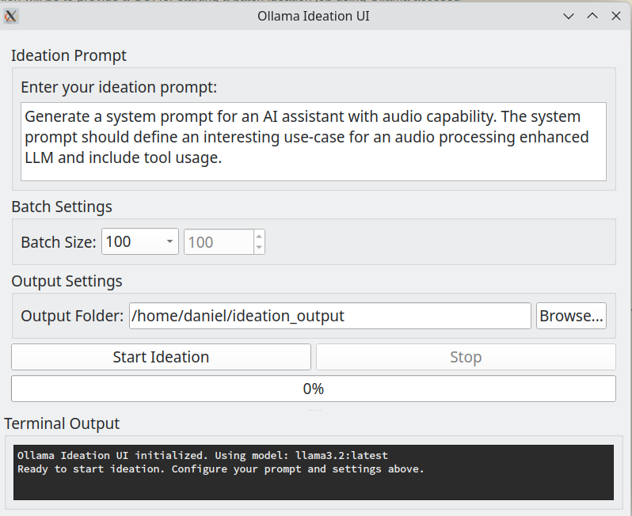
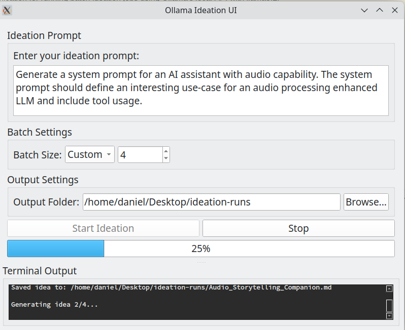
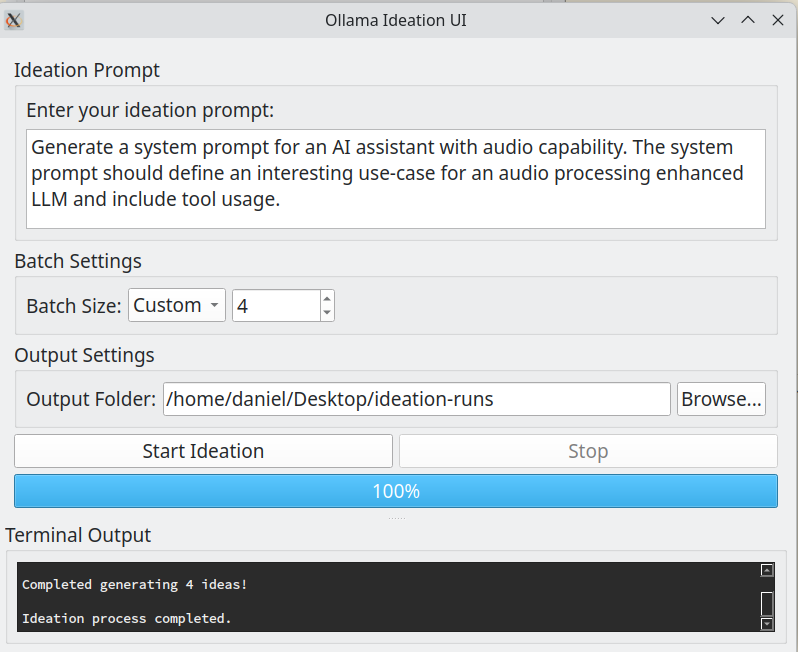

# Ollama-Ideation-UI

 

A PyQt6-based desktop application for running batch ideation jobs using Ollama's local API with llama3.2.

## Screenshots





## Overview

This application provides a graphical user interface for generating batches of ideas using Ollama's local API. It allows you to:

- Define custom ideation prompts
- Select batch sizes (100, 200, 500, 1000, 10000, or custom)
- Choose an output folder for generated ideas
- Monitor the ideation process in real-time

Each idea is saved as an individual markdown file with a filename that summarizes the idea.

## Requirements

- Python 3.6+
- PyQt6
- Ollama with llama3.2:latest model installed

## Installation

1. Clone this repository
2. Install the required dependencies:

```bash
pip install -r requirements.txt
```

3. Make sure Ollama is installed and running with the llama3.2:latest model:

```bash
ollama pull llama3.2:latest
```

## Usage

1. Run the application:

```bash
python ideation_app.py
```

2. Enter your ideation prompt in the text field
3. Select a batch size (default is 100)
4. Choose an output folder
5. Click "Start Ideation" to begin the process

The terminal output in the application will show the progress and any errors that occur during the ideation process.

## Example Prompt

```
You are a helpful assistant. Your task is to come up with an idea for a consumer information app that leverages AI and which could make the world a better place. Your idea should involve an application that uses AI to gather together and make data. Large data sets intelligible, particularly decisions taken by elected officials at local and national levels of government. To generate your suggestion use the following headers: Target market, Obstacles, Feasibility.
